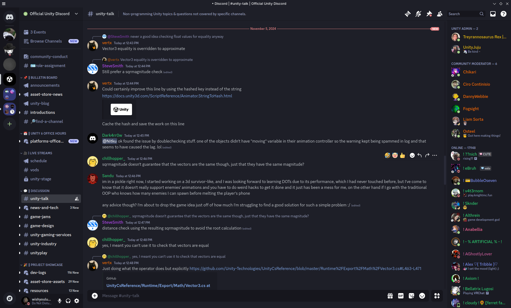

  <h2 align="center">🌊 KANAGAWA.discord 🌊</h2>

  

Discord dark colorscheme inspired by the colors of the famous painting by Katsushika Hokusai.

  

## Installation
- Download and place **theme.css** into `/home/username/.config/vesktop/themes/`
- or use this link `https://raw.githubusercontent.com/shayaharuno/kanagawa.discord/main/theme.css` and put it in your theme section
